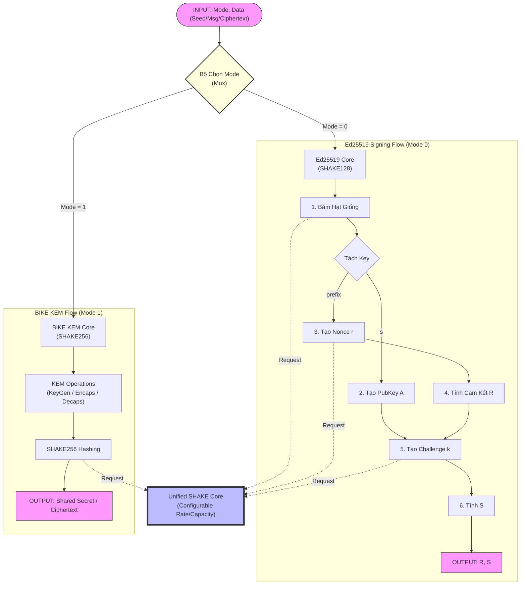

	
Flow của AES_SHAKE sau khi được update:

				
	                        |  AES_CBC(ENCRYPT)|                            |  AES_CBC(DECRYPT)|		
 TRNG---------------------->| IV               | -------------------------> | IV               |
 Password----> 	SHAKE128--->| KEY              |-----------RSA------------> | KEY              |    
 INPUT--------------------> | PLAINTEXT        |--> CIPHERTEXT--->DMA-----> | PLAINTEXT        |

  
----------------------------------------------------------------
                                                               |
----------(MỖI LẦN ACTIVE SINH VÀO 2 BUFFER)                   |
|                                                              |
|                                                              | (kHỐI ĐẦU RA TRNG )
TRNG----->|Buffer1(256 bits)|---->|[127:0] IV (AES)|           |
     |                                                         | 
     --------|Buffer(256 bits)|---->[[511:0] SEED (ED25519)]   |
---------------------------------------------------------------

----------------------------------------------------------------
                                                               |
(ĐẦU VÀO CỦA ED25519 SẼ LÀ SEED ĐƯỢC SINH RA BẰNG TRNG|        |
CỦA AES LÀ PASSWORD CỦA USER)                                  |
|                                                              |
|                                                              | (kHỐI ĐẦU RA SHAKE128 )
SHAKE128----->|Buffer1(256 bits)|---->|[127:0] KEY (AES)|      |
     |                                                         |
     -------->|Buffer(256 bits)|---->[[255:0] KEY (ED25519)]   |
---------------------------------------------------------------
                                                                

         
                                        ---------------------
                   USER --------------->|127:0] PLAIN TEXT  |
 ------------->|Buffer0(256 bits)|----->|[127:0] IV (AES)   |           
 |            |Buffer2(256 bits)|------>|127:0] KEY         |   
 |                ^                     ----------------------
 |                |
 |                ------------------------                                       
 |  USER----------------------------     |
 |                                 |     |     
 |                                 V     |                           
TRNG--->|Buffer1(256 bits)|------->SHAKE128                                                                 
                                      | 
                                      |
                                      |                           --------------------------------- 
                                      -->|Buffer3(256 bits)|----->|[255:0] KEY                      |
                                                                  |                         ED25519 |
 MẤY ANH DEFINE ĐẦU VÀO CHỖ NÀY DÙM TUI NHA---------------------->|[255:0]|MESSAGE                  |      
                                                                  ---------------------------------    

NOTE: ĐẦU RA CỦA TRNG VÀ SHAKE128 ĐỀU PHẢI VÀO BUFFER HẾT NHA
     BUFFER 0 VÀ BUFFER 1 LÀ OUT CỦA TRNG 
	BUFFER 2 VÀ BUFFER 3 LÀ OUT CỦA SHAKE

-AES chỉ được kích hoạt khi được bấm nút thông qua module MUX
-SHAKE 128 nhận password 64 bit được hash thành 128 bit để đăng độ phức tạp 
-Các tín hiệu đầu vào của SHAKE128 phải đảm bảo valid và toàn vẹn dữ liệu thông qua 2 điều kiện kích hoạt i_valid và i_last
- Tín hiệu i_ack để đảm bảo nhận 1 data mới
- tín hiệu sau khi đi ra 128 bit sẽ đi vào như hình vẽ.

Kết quả của AES_SHAKE: 
# run 1000ns
Time:                    0 | Mode: 0 | Key: 00000000000000000000000000000000 | AES Out: 66e94bd4ef8a2c3b884cfa59ca342b2e
Time:               325000 | Mode: 1 | Key: 00000000000000000000000000000000 | AES Out: 66e94bd4ef8a2c3b884cfa59ca342b2e
SHAKE Output Valid! Generated Key: 00000000000000000000000000000000
Pressing Button to start AES Encryption...
Time:               405000 | Mode: 1 | Key: 1489b8afa13506c13ca9beb999a31ec5 | AES Out: 92cc662c07e66c66f9a5ebcbd7c9f3bc
Time:               445000 | Mode: 1 | Key: 00000000000000000000000000000000 | AES Out: 66e94bd4ef8a2c3b884cfa59ca342b2e
AES Ciphertext Result: 66e94bd4ef8a2c3b884cfa59ca342b2e

Tôi là rác

