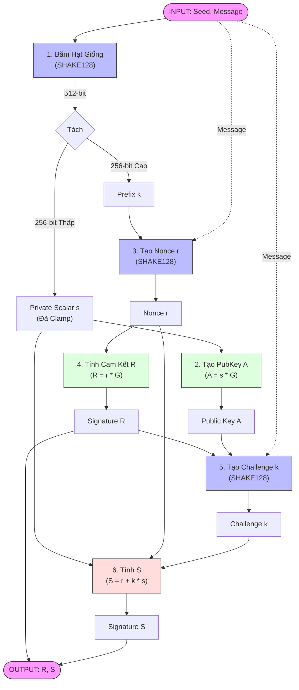

# Triển khai Phần cứng Ed25519-SHAKE128 (Verilog)

Kho lưu trữ này chứa mã nguồn thiết kế Register-Transfer Level (RTL) của **Hệ chữ ký số Ed25519** sử dụng **SHAKE128** làm hàm băm mã hóa. Thiết kế được viết bằng Verilog và hướng đến việc triển khai trên FPGA hoặc ASIC.

## 1. Tổng quan Dự án

**Ed25519** là một hệ thống chữ ký khóa công khai hiệu năng cao dựa trên Đường cong Twisted Edwards. Nó cung cấp tính bảo mật cao, tốc độ ký/xác minh nhanh và kích thước khóa nhỏ (32 byte).

Bản triển khai cụ thể này có các tính năng:
- **Tạo Khóa Công Khai (Public Key Gen)**: Tạo Khóa công khai 32 byte từ một Hạt giống riêng tư (Private Seed) 32 byte.
- **Ký (Signing)**: Tạo ra chữ ký 64 byte ($R, S$) cho một thông điệp nhất định.
- **Tích hợp SHAKE128**: Sử dụng hàm sponge Keccak/SHAKE128 cho tất cả các hoạt động băm (băm hạt giống, tạo số ngẫu nhiên nonce và tính toán challenge).


## 3. Luồng Xử Lý Chi Tiết (Flowchart)

Dưới đây là sơ đồ chi tiết cách phần cứng xử lý dữ liệu từ đầu vào (Seed, Message) để tạo ra chữ ký (R, S).



### Giải thích quy trình
1.  **Băm & Mở rộng**: Seed -> SHAKE128 -> Private Key ($s$) + Prefix.
2.  **Tạo Khóa Công khai**: $A = s \cdot G$.
3.  **Tạo Nonce**: SHAKE128(Prefix + Message) -> $r$.
4.  **Tạo Cam kết**: $R = r \cdot G$.
5.  **Tạo Thách thức**: SHAKE128(R + A + Message) -> $k$.
6.  **Tính Chữ ký S**: $S = (r + k \cdot s) \pmod L$.

## 4. Mô tả Module (Giải thích Mã nguồn)

Phần này giải thích mục đích và chức năng của từng file mã nguồn trong dự án.

### Tương tác Cấp cao nhất (Top-Level)
*   **`ed25519_tb.v`**: Testbench mô phỏng.
    *   **Vai trò**: Đóng vai trò là "Người dùng" hoặc "Host".
    *   **Chức năng**: Cung cấp **Clock**, **Reset**, **Seed** (Khóa riêng) và **Message** (Thông điệp) cho lõi. Nó giám sát các đầu ra `sig_r` và `sig_s` và so sánh chúng với các "Golden Vectors" (Test Cases đã biết) để xác minh tính chính xác.
    *   **Tests**: Hiện được cấu hình để chạy các Test Case tiêu chuẩn (ví dụ: vector RFC 8032).

*   **`ed25519_shake128.v`**: Wrapper SOC.
    *   **Vai trò**: Logic kết nối tích hợp.
    *   **Chức năng**: Khởi tạo cả Lõi Ed25519 (`ed25519_top`) và Lõi Băm (`shake128_top`). Nó kết nối vật lý giao diện Yêu cầu/Phản hồi Băm của Lõi Ed25519 với module SHAKE. Điều này cho phép lõi Ed25519 "gọi" hàm băm.

*   **`ed25519_top.v`**: Bộ điều khiển chính ("Bộ não").
    *   **Vai trò**: Máy trạng thái hữu hạn (FSM) & Điều khiển chính.
    *   **Chức năng**: Điều phối toàn bộ quy trình ký.
    *   **Luồng Logic**:
        1.  **IDLE**: Chờ tín hiệu `start`.
        2.  **HASH_SEED**: Gửi Seed đến SHAKE128 để tạo Private Scalar ($s$) và Prefix.
        3.  **GEN_PUBKEY**: Tính $A = s \cdot G$ (Khóa công khai) sử dụng `scala_mul_25519`.
        4.  **GEN_NONCE**: Băm (Prefix + Message) để tạo số ngẫu nhiên nonce ($r$).
        5.  **GEN_R**: Tính $R = r \cdot G$ sử dụng `scala_mul_25519`.
        6.  **HASH_CHALLENGE**: Băm ($R, A, M$) để tạo challenge $k$.
        7.  **CALC_S**: Tính Chữ ký $S = (r + k \cdot s) \pmod L$.
        8.  **FINISH**: Xuất ra $(R, S)$.

### Các Nguyên thủy Mật mã (Cryptographic Primitives)
*   **`scala_mul_25519.v`**: Bộ nhân Vô hướng.
    *   **Toán học**: Tính $Q = k \cdot P$ (trong đó $k$ là số nguyên 256-bit, $P$ là điểm trên đường cong).
    *   **Thuật toán**: Sử dụng thuật toán "Double-and-Add". Duyệt qua các bit của số vô hướng từ MSB đến LSB. Với mỗi bit, nó "Nhân đôi" điểm hiện tại. Nếu bit là 1, nó cũng "Cộng" thêm điểm cơ sở.

*   **`point_op_25519.v`**: Các phép toán trên Điểm Đường cong Elliptic.
    *   **Toán học**: Thực hiện Cộng điểm ($P_1 + P_2$) và Nhân đôi điểm ($2 \cdot P$) trên đường cong Edwards.
    *   **Tọa độ**: Sử dụng **Extended Twisted Edwards Coordinates** $(X, Y, Z, T)$ để tránh các phép chia đắt đỏ trong vòng lặp. Chỉ thực hiện một phép nghịch đảo mô-đun ở bước cuối cùng.

### Số học Mô-đun ("Máy tính")
Các module này hoạt động trên các số nguyên 255-bit trong trường $\mathbb{F}_{2^{255}-19}$.

*   **`arithmetic.v`**: Wrapper cấp cao cho các phép tính cơ bản (gọi các module con).
*   **`add_sub_25519.v`**: Bộ Cộng/Trừ Mô-đun.
    *   Tính $(A \pm B) \pmod P$. Xử lý việc nhớ (carry) cho các số lớn 256-bit.
*   **`mul_25519.v`**: Bộ Nhân Mô-đun.
    *   Tính $(A \times B) \pmod P$. Đây là module nặng nhất. Nó thực hiện nhân số nguyên và sau đó rút gọn kết quả 512-bit theo modulo $2^{255}-19$.
*   **`inv_25519.v`**: Nghịch đảo Mô-đun.
    *   Tính $A^{-1} \pmod P$. Cần thiết để chuyển đổi tọa độ Projective $(X, Y, Z)$ trở lại Affine $(x, y)$ ở cuối quy trình (Tọa độ $x = X \cdot Z^{-1}$).
*   **`reducer.v`**: Bộ Rút gọn Mô-đun.
    *   Cụ thể rút gọn các số lớn (như đầu ra băm) theo modulo Bậc của Nhóm $L$ (để tính $S$).

### Lõi Băm (SHAKE128)
*   **`shake128_top.v`**: Wrapper giao diện cho Keccak.
*   **`keccak_f1600.v`**: Hàm Hoán vị cốt lõi của SHA-3/SHAKE.
*   **`sponge.v`**: Triển khai cấu trúc "Sponge" (Absorb data -> Permute -> Squeeze hash).

## 5. Cách chạy Mô phỏng

Dự án được thiết lập cho **Icarus Verilog**, một trình mô phỏng Verilog mã nguồn mở miễn phí.

### Yêu cầu
- `iverilog` (Trình biên dịch)
- `vvp` (Trình chạy mô phỏng)

### Lệnh chạy
Chạy lệnh duy nhất này trong terminal của bạn để biên dịch và xác minh thiết kế:

```bash
iverilog -o ed25519_sim ed25519_tb.v ed25519_shake128.v ed25519_top.v scala_mul_25519.v point_op_25519.v add_sub_25519.v inv_25519.v mul_25519.v arithmetic.v reducer.v keccak_f1600.v keccak_round.v sponge.v shake128_top.v && vvp ed25519_sim
```

### Cách đọc Kết quả
Mô phỏng sẽ in ra:
1.  **Đầu ra**: Chữ ký R và S được tạo ra.
2.  **Kiểm tra**: `PASS` hoặc `FAIL` cho mỗi Test Case.

Ví dụ Kết quả Thành công:
```text
>> TC2 Result: PASS (All checks passed)
```

## 6. Cấu trúc Thư mục
*   `*.v`: Các file nguồn Verilog.
*   `verify_logic.py`: Script Python dùng để xác minh logic nội bộ của phần cứng bằng toán học (White-box testing).
*   `walkthrough.md`: Bản ghi lại quy trình xác minh và kết quả.

---
**Tác giả**: Vo Hoang Nguyen
**Công cụ hỗ trợ**: Google DeepMind Agentic Coding Assistant
